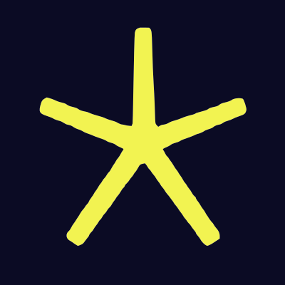

<h1 align="center">Advent of Code 2021</h1>

    

## Puzzles

- [Day 1: Sonar Sweep](./day1) [[parsing](./day1/parse.mjs), [solution](./day1/index.mjs)]
- [Day 2: Dive!](./day2) [[parsing](./day2/parse.mjs), [solution](./day2/index.mjs)]
